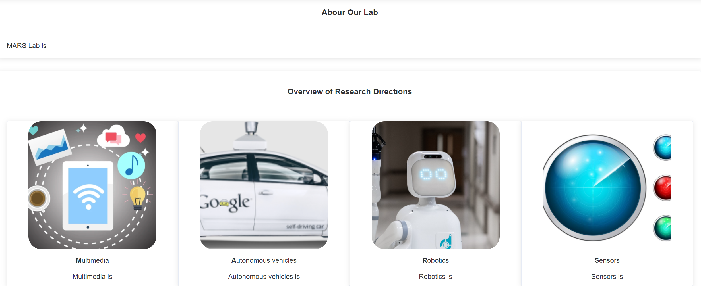

# THU-MARS-Web

MARS 主页的**内容仓库**。组员在这里更新项目、论文、新闻、人员和图片，push 到 `main` 分支即可，**不需要安装任何环境、不需要构建**。管理员会定期把内容同步到构建工程并发布上线。

## 你能改什么

| 内容 | 位置 |
| --- | --- |
| 首页文字、项目、论文、新闻、人员等数据 | `main.js` |
| 实验室介绍 | `about_our_lab.vue` |
| 图片 | `images/` |

> 注意：网站的页面结构、样式和构建配置不在这个仓库，请不要新建 `.vue` 页面或改其他文件。

## 基本规则

- `main.js` 是 JavaScript 数据文件，**引号、逗号、括号必须成对**。内容里包含英文引号时，前面加转义字符 `\`（例如 `it\'s`）。
- 改完建议本地用 `node --check main.js` 验证语法（可选），再 commit + push。
- 想暂时下线某个项目：**用 `//` 注释掉对应条目，不要删除**，以后取消注释即可恢复。
- 图片命名用小写字母和下划线（如 `my_project.png`）；项目卡片图宽度建议 ≤ 1000px、文件 ≤ 500KB；首页横幅图不要改动。

## 常见操作

### 添加一个项目（单论文卡片）

在 `main.js` 的 `projects: [` 数组开头（最新项目在最前）添加：

```js
{
  title: 'Paper Title',
  publisher: 'CVPR 2026',
  authors: 'First Author*, Second Author*, Hang Zhao',
  description: '"One sentence summary."',
  paper_link: 'https://arxiv.org/abs/XXXX.XXXXX',
  project_link: 'https://your-project-page.github.io/',
  image: 'my_project.png',
  extra_link: [
    {
      name: 'Code',
      link: 'https://github.com/xxx/xxx',
    },
  ],
},
```

`description`、`project_link`、`extra_link` 没有时可以省略或留空。图片文件放进 `images/` 目录，`image` 填文件名。

### 添加一个项目（多论文合并卡片）

同一个项目的多篇论文放在一张卡片里，用 `papers` 数组，每篇论文有自己的标题、会议、作者和链接：

```js
{
  image: 'my_project.png',
  papers: [
    {
      title: 'New Paper Title',
      publisher: 'Preprint 2026',
      authors: 'First Author, Second Author, Hang Zhao',
      paper_link: 'https://arxiv.org/abs/XXXX.XXXXX',
      project_link: 'https://project-page.github.io/',
      code_link: 'https://github.com/xxx/xxx',
    },
    {
      title: 'Earlier Paper Title',
      publisher: 'ECCV 2026',
      authors: 'First Author, Hang Zhao',
      paper_link: 'https://arxiv.org/abs/YYYY.YYYYY',
      project_link: 'https://earlier-project-page.github.io/',
    },
  ],
},
```

每篇论文的文字下方会自动带上它自己的 Paper / Project / Code 按钮。

### 修改研究方向介绍等文字

在 `main.js` 中找到 `overview_of_research_directions` → `content`，修改对应的值即可。

### 更换图片

把新图片放入 `images/` 目录，在 `main.js` 中找到对应条目的 `image` 字段，改成新文件名。参考下图：



### 更新人员 / 新闻

人员数据在 `main.js` 中的人员列表，新闻在新闻列表，格式仿照已有条目即可。头像照片同样放入 `images/`。

## 修改之后

1. `git add` 你改动的文件（`main.js` 和新增的图片），`git commit`，`git push`。
2. 通知管理员有新内容，管理员会同步、构建并发布到 <https://group.iiis.tsinghua.edu.cn/~marslab/>。
3. 如果发布后页面异常，管理员会回滚内容仓库的对应提交，不会影响到其他内容。
