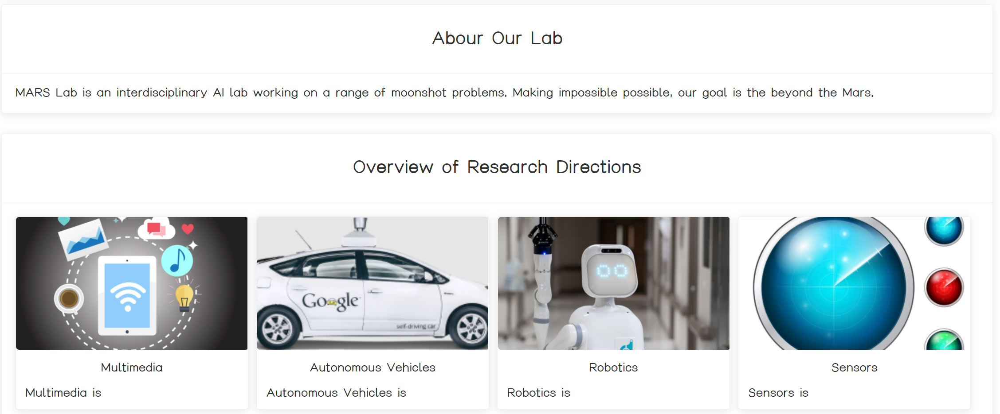

# THU-MARS-Web

### 文字修改
例如，当需要修改下图中的Multimedia的介绍时，在main.js中找到overview_of_research_directions→content，修改对应的值即可。

> 如果内容中包含引号，需要在引号前添加转义字符 '\'

### 图片修改
例如，当需要修改下图中的Multimedia的图片时，将想要的图片放在images目录下，然后在main.js中找到overview_of_research_directions→image，将对应的值修改为图片的文件名。

